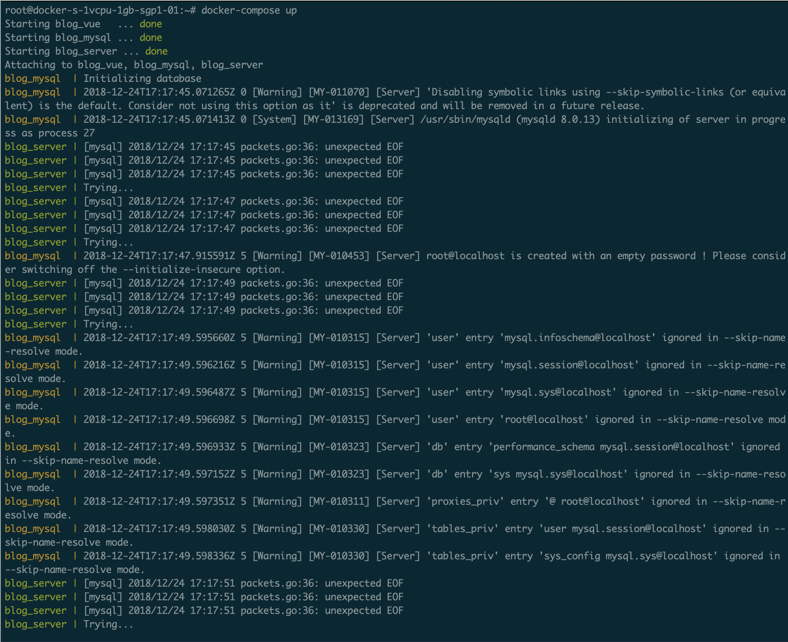
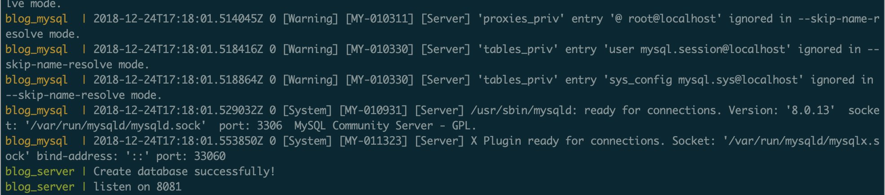

# 容器化小组项目实践

#### 小组个人博客
钟文谦 - [项目容器化-DockerFile学习之路](https://zhongwq.github.io/ServiceComputingOnCloud/%E9%A1%B9%E7%9B%AE%E5%AE%B9%E5%99%A8%E5%8C%96-DockerFile%E5%AD%A6%E4%B9%A0%E4%B9%8B%E8%B7%AF/)

章恒 - [Docker 开发初体验](https://clearloveh.github.io/2018/12/20/service-computing-docker/)

### Docker部署实践
具体的Dockerfile的书写在[小组个人的博客](https://zhongwq.github.io/ServiceComputingOnCloud/%E9%A1%B9%E7%9B%AE%E5%AE%B9%E5%99%A8%E5%8C%96-DockerFile%E5%AD%A6%E4%B9%A0%E4%B9%8B%E8%B7%AF/)里已经给出，这里简单说说写好Dockerfile后的部署过程

我们首先在Docker Hub中建立对应的仓库，并与我们的Github仓库进行绑定，Create 完成后，点击右边的Create & Build即可


等待一段时间，我们就可以看到我们的镜像已经build成功了。若是build失败的话，我们还可以查看DockerHub给出的日志进行Debug


服务端容器的操作也基本类似，都是创建仓库与github绑定，让其自动build

那么我们现在就可以书写我们的docker-compose脚本了

那么我们先想想我们为什么要使用docker-compose来启动我们的应用呢?

因为我们这个应用的运行需要多个容器的运行，若是一个个手动配置就太麻烦了，而 Compose 是一个用户定义和运行多个容器的 Docker 应用程序。在 Compose 中你可以使用 YAML 文件来配置你的应用服务。然后，只需要一个简单的命令，就可以创建并启动你配置的所有服务。让我们更加方便创建并启动我们配置的所有服务

```
version: "3"
services:
  web:
    image: wilsonzhong/minimalblog-vue:latest
    container_name: blog_vue
    ports:
      - 80:80
  database:
    image: wilsonzhong/minimal_blog_mysql:latest
    environment:
      MYSQL_ROOT_PASSWORD: XXXXXXXX
    container_name: blog_mysql
    ports:
      - 3306:3306
    volumes:
      - ~/mysql:/var/lib/mysql
  server:
    image: wilsonzhong/minimal_blog_server:mysql
    container_name: blog_server
    depends_on:
      - database
    ports:
      - 8081:8081
```

不过在这里遇到了一些问题，dependsOn是无法完全解决我们的server需要在服务器环境生效之后才可以建立有效链接的问题，如果不注意的话很容易就会报错，导致服务无法正常启动，所以，对于这个问题，我在go层面做了优化,通过使用db.Ping()间断确认DB的可用性，只有在服务可用时才继续往下运行


```go
err = DB.Ping()
for {
	if err == nil {
		break
	}
	fmt.Println("Trying...")
	time.Sleep(time.Duration(2)*time.Second)
	err = DB.Ping()
}
```


这样的优化体现在运行时就是这样的，可以看到，blog_server服务在我们的database初始化的时候一直在进行Trying..，到最后，db初始化完毕，可以看到server直接往后运行，提示建表成功，处理了这个bug之后，我们的应用就可以直接通过docker-compose up -d部署了，还是非常方便的


...

最终



### 体会

在一开始不知道docker-compose的使用方法的时候，遇到很多错误，mysql容器配置发送挺多问题，经过逐层Debug，在解决所有问题之后，感觉docker-compose还是十分给力的，我们不再需要对于每一个镜像进行一一的部署，通过合理配置我们的docker-compose, 我们就可以完成我们整个项目的部署，舒服的一批。

