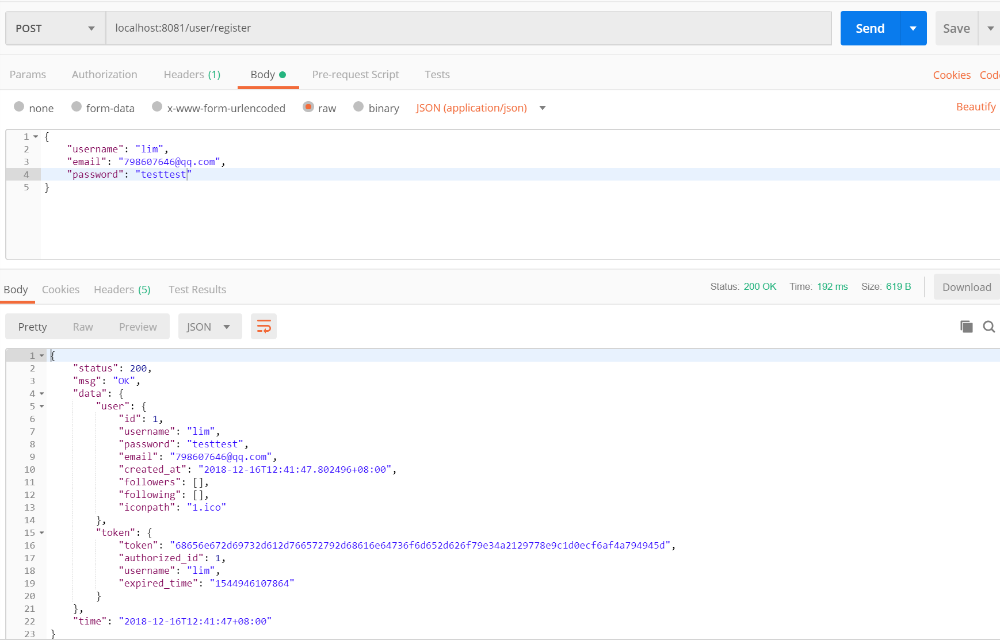
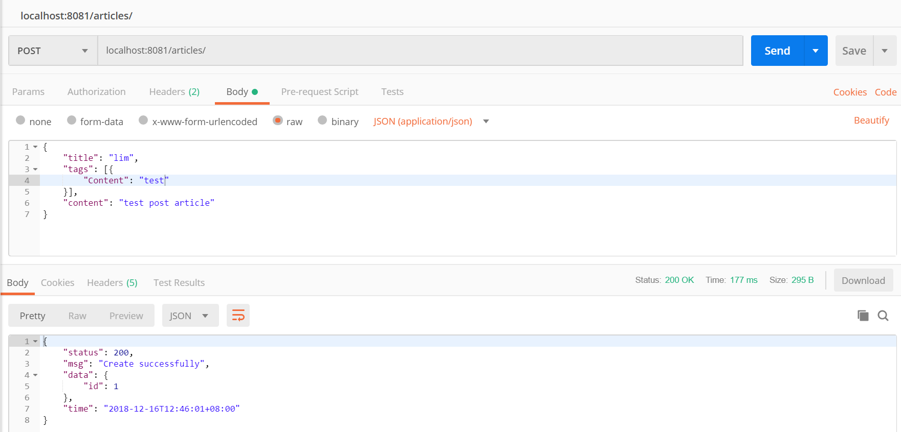
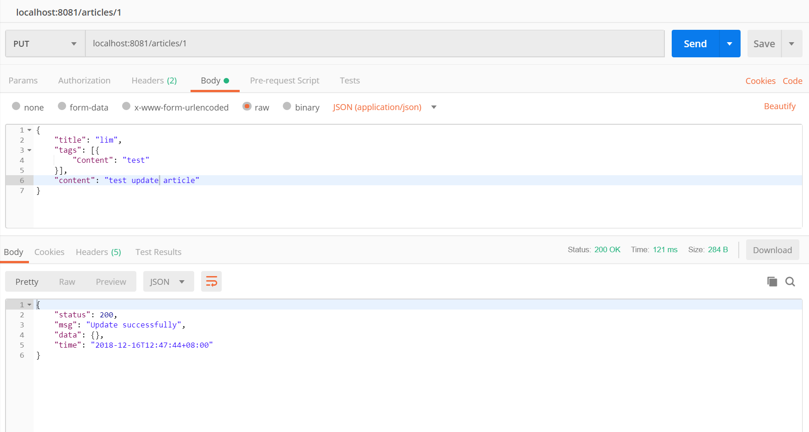
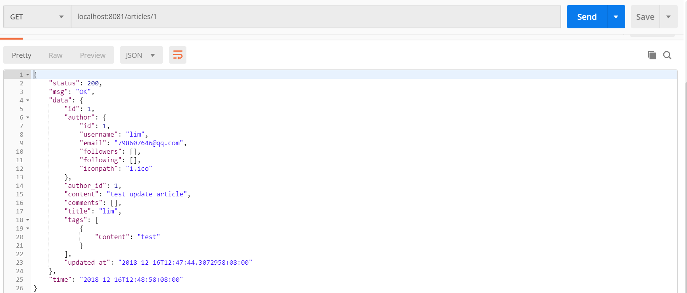

# 项目文档

### 仓库地址
[前端](https://github.com/GoProjectGroupForEducation/MinimalBlog-Vue)

[后端](https://github.com/GoProjectGroupForEducation/Go-Blog)

### 安装指南
##### 前端

前端部分需要先把项目先clone下来, 执行命令如下

```bash
git clone https://github.com/GoProjectGroupForEducation/MinimalBlog-Vue.git
cd MinimalBlog-Vue
npm install
npm run dev
```

##### 后端
后段部分直接通过执行以下go get命令进行安装

```bash
go get github.com/GoProjectGroupForEducation/Go-Blog
```

执行完成后，我们就可以通过`./Go-Blog`打开服务了


### 项目博客来源

组内成员个人平时所写的博客

### API设计

##### article

- `GET /articles/?pageNum={pageNum}` 根据请求的页数pageNum获取当前页数的文章
- `GET /articles/user/{user_id}` 根据用户id获取该用户的文章
- `GET /articles/tag/{tag_content}` 根据tag获取含有该tag的文章
- `GET /articles/concerning` 获取已关注的文章
- `GET, PUT /articles/{article_id}` 更新或获取含有相应id的文章
- `GET, POST /articles/{article_id}/comments` 更新或获取含有相应id文章的评论
- `GET, PUT /articles/{article_id}/comments/{comment_id}` 更新或获取含有相应id文章的含有对应id的评论

##### user

- `GET /user/allusers` 获取所有用户
- `GET, PUT /user/{user_id}` 获取含有对应id的用户
- `GET /user/{user_id}/follower`  获取含有对应id的用户的follower
- `GET /user/{user_id}/following` 获取含有对应id的用户follow的用户
- `POST /user/login` 登陆请求
- `POST /user/register` 注册请求
- `POST /user/icon/{filename}` 更新用户头像
- `POST /user/follow` follow某用户
- `POST /user/unfollow` 取消follow某用户

##### tag

- `GET /tag` 获取所有已存在的tag

##### Example

- 用户登陆



- 新建文章



- 获取分页号为1的文章，data中还含有一个Number字段标识文章的总数量，Articles字段存放分页号为1的文章，一个分页有6篇文章


- 更新文章



- 获取id为1的文章




### 前端使用效果截图

未登陆，主页（可以通过点击标签查看当前标签下的所有文章，博客列表可以点击自己写的博客才有的list（右下角3个点来点击Edit进行编辑））


登陆后，主页


AddPost页面(拖入图片即可自动发送图片到后端，传回图片静态文件地址，自动以md格式添加到拖入光标处)


用户个人主页


博客页面，可以通过点击标签查看当前标签下的所有文章,登陆后可以进行评论

未登陆


登陆后


评论也可以编辑，和博客一样点击3个点的列表点击Edit就可编辑，不过Comment较为简单，所以只弹出一个弹窗提供更改


